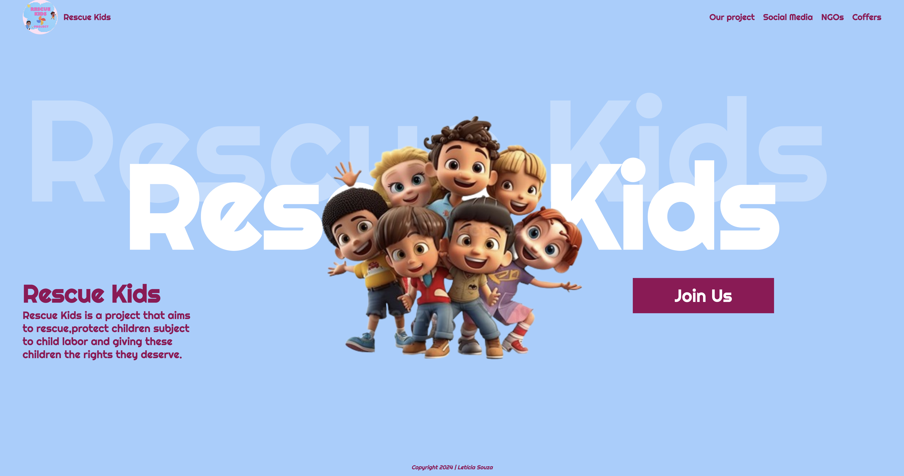
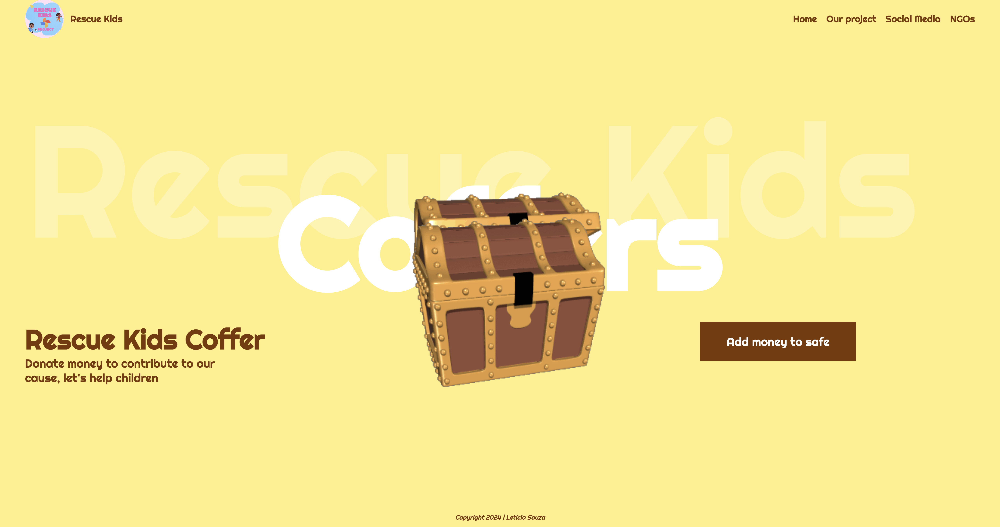

# Tabalho-ingles

### Página inicial 

### Página Cofre 

---
## Sobre
Site do tipo landing page para divulgar um projeto de inglês, sobre uma campanha contra o trabalho infantil. O intuito deste projeto é apresentar uma solução prática para diminuir e/ou acabar com o Trabalho Infantil. Também colocar em prática o conhecimento adquirido sobre as linguagens de marcação, HTML, CSS e Markdown, no curso Técnico de Desenvolvimento de Sistemas do [SENAI JANDIRA](https://sp.senai.br/unidade/jandira/) e aprimorar o inglês.

Landing page type website to promote an English project, about a campaign against child labor. The aim of this project is to present a practical solution to reduce or end Child Labor. Also put into practice the knowledge acquired about markup languages, HTML, CSS and Markdown, in the Systems Development Technician course at [SENAI JANDIRA](https://sp.senai.br/unidade/jandira/) and improve the English.

---
## Tecnologias utilizadas 
- HTML
- CSS
- Markdown
- Git

---
## Autores 
- [Letícia Souza](https://www.linkedin.com/in/leticia-souza-almeida-84712a2b5/)
- Isabelly Lima 